# 🌀 ResearchPulse

Real-time academic research intelligence platform — Powered by a Node.js/Express API, React + Vite frontend, and a Python Sentence-Transformers embeddings microservice.

---

## 👨‍💻 Developer Details

<div align="center">
  <h3>Sumanshu Jindal</h3>
  <p>Full Stack AI & Platform Engineer</p>
  <a href="https://www.linkedin.com/in/sumanshu-jindal01/"></a>
  <a href="https://github.com/Sumanshu01"></a>
</div>

---

## 📖 Table of Contents
- [Project Importance](#-project-importance)
- [Tech Stack](#%EF%B8%8F-tech-stack)
- [Key Features](#-key-features)
- [System Architecture](#%EF%B8%8F-system-architecture)
- [Repository Layout](#-repository-layout)
- [Database Schema (MongoDB)](#-database-schema-mongodb)
- [API Reference](#-api-reference)
- [Environment Variables Configuration](#-environment-variables-configuration)
- [Local Development Setup](#-local-development-setup)
- [Docker & Containerization](#-docker--containerization)
- [Production Deployment Guidance](#-production-deployment-guidance)
- [Kubernetes Orchestration](#-kubernetes-orchestration)
- [CI/CD Pipeline](#-cicd-pipeline)
- [Monitoring & Troubleshooting](#-monitoring--troubleshooting)

---

## 💡 Project Importance

In the rapidly expanding world of academia and research, staying up-to-date with relevant scientific breakthroughs is a daunting task. Thousands of research papers are published daily across platforms like arXiv, Semantic Scholar, Crossref, and PubMed. 

**ResearchPulse** bridges the gap between raw research feeds and actionable insights. It aggregates scientific papers, runs background processing jobs, calculates dense vector embeddings, groups papers into semantic clusters, runs AI-powered analysis to highlight gaps and summarize structures, and serves these insights to researchers in real-time. By automating search, semantic similarity matching, and topic tracking, ResearchPulse empowers researchers to spot emerging trends, uncover under-explored research directions, and stay notified about crucial publications instantly.

---

## 🛠️ Tech Stack

ResearchPulse leverages a modern multi-service stack optimized for speed, scalability, and developer experience:

*   **Frontend**: 
    *   **React 18** (Vite-powered Single Page Application)
    *   **Redux Toolkit & React-Redux** (Client-side state management)
    *   **React Router v6** (Declarative client-side routing)
    *   **Recharts & D3.js** (Dynamic data visualizations, trend charts, and research maps)
    *   **Tailwind CSS & PostCSS** (Premium glassmorphic styling, HSL tailwind color palettes, micro-animations)
    *   **Socket.IO-Client** (Real-time duplex notification listener)
*   **Backend API Gateway & Workers**:
    *   **Node.js (ESM)** & **Express** (REST API endpoints & middleware routing)
    *   **BullMQ & ioredis** (Redis-backed multi-concurrency background job processing and scheduling)
    *   **Socket.IO** (Real-time updates server)
    *   **Winston** (Centralized logging with customizable log levels)
    *   **Swagger UI Express & Swagger JSDoc** (Interactive OpenAPI 3.0 API documentation at `/api/docs`)
*   **AI & Embeddings Service**:
    *   **Python 3.11** & **Flask** (Microservice web framework)
    *   **Sentence-Transformers** (`all-MiniLM-L6-v2` model generating 384-dimensional dense vector embeddings)
    *   **PyTorch & NumPy** (Vector calculation operations)
    *   **Google Gemini API (`gemini-1.5-flash`)** via `@google/generative-ai` (Structured JSON paper summaries, gap analysis, and growth forecasting)
*   **Datastores**:
    *   **MongoDB (Mongoose ODM)** (Persistent database; indexes on titles, sparse DOIs, and category tags)
    *   **Redis (ioredis client)** (Caching layer, BullMQ task manager, and WebSocket scaling bridge)

---

## ✨ Key Features

1.  **Multi-Source Ingestion Pipeline**: Ingests publications from multiple public academic search endpoints:
    *   **arXiv** (Automated parsing of Atom XML feeds)
    *   **OpenAlex API** (Normalized authors, metadata, and citation tracking)
    *   **Semantic Scholar API** (Retrieving abstracts, category domains, and open access links)
    *   **Crossref API** (DOI resolution, author affiliations, and publisher metrics)
    *   **PubMed PMC API** (Biomedical and genetic research articles)
    *   *Continuity Fallback*: Includes an intelligent mock data generator if external networks are rate-limited or offline.
2.  **Dense Semantic Search & Similarities**:
    *   Converts paper title + abstract to a 384-dimensional vector embedding.
    *   Computes cosine similarity in JavaScript with Redis caching for ultra-fast, context-based recommendations.
    *   Graceful fallback to category-based matching when the embedding service is offline.
3.  **Gemini AI summarization & Forecasting**:
    *   Extracts structural information: Executive summaries, key contributions, main findings, limitations, future work, and research methodology.
    *   Scours topic clusters to identify research gaps (under-explored intersections).
    *   Runs time-series forecasting to predict topic growth rate over custom horizons.
4.  **Personalized Recommendation Engine**:
    *   Evaluates paper candidate scores based on: followed topics (+30 pts), followed authors (+40 pts), citation volume, trend metrics, and recency boosts (e.g. +15 pts for articles published within the last 30 days).
5.  **Analytics & Trend Radar**:
    *   Classifies scientific topics as `emerging`, `growing`, `stable`, or `declining`.
    *   Computes Top Author and Top Institution leaderboards based on aggregate publication count and citation growth.
6.  **Real-Time Push Alerts**:
    *   Socket.IO server broadcasts newly ingested papers.
    *   Monitors user-subscribed topic or author parameters and pushes push/email alert triggers when matches occur.

---

## 🗺️ System Architecture

```mermaid
flowchart TB
  subgraph Client [Client Tier]
    Browser["React SPA (Vite + Redux)"]
  end

  subgraph Gateway [Load Balancing & Ingress]
    LB["Nginx / Load Balancer"]
  end

  subgraph Services [Application Core Services]
    API["Node.js/Express API (Port 5000)"]
    Worker["BullMQ Worker Pool"]
    Flask["Flask Embedding Service (Port 5001)"]
  end

  subgraph Datastores [Data & Cache Tier]
    Mongo[("MongoDB (Papers, Users, Trends)")]
    Redis[("Redis (Queues, Cache, PubSub)")]
  end

  subgraph External [External APIs]
    Gemini["Google Gemini AI"]
    PaperAPIs["arXiv / Semantic Scholar / OpenAlex / Crossref / PubMed"]
  end

  Browser <-->|HTTPS / Socket.IO| LB
  LB <--> API
  
  API <--> Mongo
  API <--> Redis
  API <--> Flask
  
  Worker <--> Redis
  Worker <--> Mongo
  
  API -.-> Gemini
  Worker -.-> PaperAPIs
  Flask -.->|Sentence-Transformers| Flask
```



### Dynamic Execution Resiliency
*   **Database Seeder Check**: On boot, the server checks MongoDB. If paper volume is low or zero, it launches a background seeding process covering 15 core research areas.
*   **Redis Cache Fallback**: If Redis disconnects, the cache wrappers automatically switch to a localized `Map` with custom expire TTLs. Ingestions and alerts continue via an in-memory `setInterval` schedule.
*   **Embedding Service Fallback**: If the Python microservice is unreachable, the system generates random unit-length vectors. Similarities still work gracefully by checking overlaps in category tags.

---

## 📁 Repository Layout

```
.
├── backend/
│   ├── src/
│   │   ├── config/          # DB, Redis, Winston Logger configurations
│   │   ├── controllers/     # Controller handlers (Auth, AI, Analytics, Papers, Users)
│   │   ├── jobs/            # BullMQ job queues, schedulers, and workers
│   │   ├── middleware/      # Rate limiters, JWT verification, validation schemas
│   │   ├── models/          # 12 Mongoose Schemas for MongoDB collections
│   │   ├── routes/          # REST route mappings and Swagger config
│   │   ├── services/        # Business logic services (Gemini, Ingestion, Recommendations, Socket)
│   │   ├── scripts/         # bulkSeed.js helper utility
│   │   └── index.js         # Backend entrypoint (boots servers & gracefully shuts down)
│   ├── package.json
│   └── Dockerfile
├── embedding-service/
│   ├── app.py               # Flask endpoints serving model embeddings & similarity scores
│   ├── requirements.txt     # Python libraries (sentence-transformers, flask, torch)
│   ├── start.bat            # Windows startup script
│   └── Dockerfile
├── frontend/
│   ├── src/
│   │   ├── components/      # UI components (Navbar, Sidebar, Footer, Stats, Cards, Charts)
│   │   ├── hooks/           # Custom React hooks
│   │   ├── pages/           # View layouts (Dashboard, Search, TrendRadar, TopicExplorer, Analytics)
│   │   ├── store/           # Redux Toolkit configuration & auth/nav slices
│   │   ├── App.jsx          # Route definitions & router providers
│   │   └── main.jsx         # App bootstrapping
│   ├── index.html
│   ├── tailwind.config.js
│   ├── postcss.config.js
│   ├── vite.config.js
│   └── Dockerfile
├── package.json             # Root commands (concurrently starts dev-backend and dev-frontend)
├── docker-compose.yml       # Production-ready composition for all containers
└── README.md                # Detailed project documentation
```

---

## 🗄️ Database Schema (MongoDB)

ResearchPulse uses MongoDB with Mongoose definitions. Here are the active models:

1.  **User**: Standard logins, JWT secrets, followed topics, followed authors, reading history (capped at last 50 entries), and active alert subscriptions (topic, citation milestone, or author).
2.  **Paper**: Stores paper abstracts, sparse unique DOIs, citation counts, category tag arrays, URLs, and floating dense embedding vectors.
3.  **Author**: Tracked authors, total publications counts, citations counts, and affiliations.
4.  **Institution**: Academic organizations, geographical location, publication numbers, and citation aggregate statistics.
5.  **AiSummary**: Caches Gemini responses (executive summary, contributions, findings, limitations, future work, methodology) mapped to a paper.
6.  **Trend**: Growth charts for topics daily, weekly, or monthly (publication counts, citation growth, growth percent, trend score, status).
7.  **TopicCluster**: Predefined groupings (AI, Health, Quantum, Climate) tracking aggregations.
8.  **Notification**: Real-time websocket and in-app alerts (read/unread states).
9.  **Recommendation**: Pre-computed custom user recommendation scores.
10. **SavedPaper**: User bookmark libraries.
11. **Topic**: Followers tracking and growth indicators.
12. **Citation**: Historical citations tracker.

---

## 🔌 API Reference

Full interactive Swagger docs are available at `/api/docs`.

### Authentication
*   `POST /api/auth/register` — Create researcher account.
*   `POST /api/auth/login` — Sign in and receive JWT token.
*   `POST /api/auth/logout` — Revoke session.
*   `GET /api/auth/me` — Check active credentials.

### Discovery & Search
*   `GET /api/papers` — Paginated list of ingested papers. Filter by topic, author, or publisher source.
*   `GET /api/papers/:id` — Detail view for a paper. Inserts a record into the user's reading history.
*   `GET /api/search` — Search query papers.
*   `GET /api/authors/rankings` — Leaderboards for top authors.
*   `GET /api/institutions/rankings` — Top university affiliations.

### AI & Recommendations
*   `GET /api/ai/summary/:paperId` — Get or generate structured summary.
*   `POST /api/ai/summary/:paperId/generate` — Force regenerate summary using Gemini.
*   `GET /api/ai/similar/:paperId` — Retrieve semantically similar papers.
*   `GET /api/ai/gaps` — Generate identified gaps within active topic clusters.
*   `GET /api/ai/recommendations` — Fetch personalized paper feeds.
*   `POST /api/ai/recommendations/refresh` — Re-score and refresh recommendations.
*   `GET /api/ai/predictions?topic=X&horizon=6` — Monthly publication volume forecasting.

### Trends & Analytics
*   `GET /api/analytics/trends` — Topic trends over time.
*   `POST /api/analytics/trends/compute` — Trigger manually.
*   `GET /api/analytics/citations` — H-Index metrics and category citations.
*   `GET /api/analytics/topics` — Get computed topic semantic groups.
*   `GET /api/analytics/dashboard` — Global platform metrics overview.
*   `GET /api/analytics/timeseries` — Monthly timelines for specific terms.

### Subscriptions & Notifications
*   `GET /api/alerts` — Paged notifications.
*   `PUT /api/alerts/read-all` — Dismiss alerts.
*   `PUT /api/alerts/:id/read` — Dismiss specific alert.
*   `POST /api/alerts/subscribe` — Subscribe to author/topic push alerts.
*   `DELETE /api/alerts/subscribe/:refName` — Unsubscribe.

---

## ⚙️ Environment Variables Configuration

Create a `.env` file in your `backend/` directory for local execution:

```env
PORT=5000
NODE_ENV=development
LOG_LEVEL=debug

# Databases & Caches
MONGO_URI=mongodb://127.0.0.1:27017/research_pulse
REDIS_URL=redis://127.0.0.1:6379

# Cryptographic Keys & Integrations
JWT_SECRET=add_your_secure_jwt_random_string_here
GEMINI_API_KEY=AIzaSy...   # Optional: Mock fallback is used if omitted

# Microservice URLs
EMBEDDING_SERVICE_URL=http://localhost:5001

# SMTP Email Alert Configuration
SMTP_HOST=smtp.mailtrap.io
SMTP_PORT=2525
SMTP_USER=your_smtp_user
SMTP_PASS=your_smtp_password
```

---

## 🚀 Local Development Setup

### Prerequisites
*   **Node.js 18+** & `npm`
*   **Python 3.11+** & `pip`
*   **MongoDB & Redis** (Or Docker to spin them up instantly)

### Step 1: Install Node Dependencies
In the root directory, run the helper command to install dependencies across the workspace:
```bash
npm run install-all
```

### Step 2: Install Python Embedding Dependencies
```bash
cd embedding-service
# (Recommended) Create virtual environment
python -m venv venv
venv\Scripts\activate   # On Windows
source venv/bin/activate # On Unix/macOS

# Install libraries
pip install -r requirements.txt
cd ..
```

### Step 3: Run Databases via Docker
If you do not have MongoDB and Redis installed natively, run these Docker commands:
```bash
# Start MongoDB Container
docker run -d --name pulse_mongo -p 27017:27017 -v pulse_mongo_data:/data/db mongo:6

# Start Redis Container
docker run -d --name pulse_redis -p 6379:6379 redis:7
```

### Step 4: Boot the Platform
Open multiple terminal sessions, or utilize the root dev command:

#### Terminal 1: Embedding Microservice
```bash
cd embedding-service
# (Ensure virtual environment is active)
python app.py
```

#### Terminal 2: Concurrently start React & Express Dev Servers
In the repository root directory, run:
```bash
npm run dev
```

Visit the platform:
*   **Frontend web page**: `http://localhost:5173`
*   **Backend server landing**: `http://localhost:5000/`
*   **Interactive API documentation**: `http://localhost:5000/api/docs`
*   **Embedding Service check**: `http://localhost:5001/health`

---

## 🐳 Docker & Containerization

All components are containerized for zero-friction deployments. 

### Local Composition
Run the entire ecosystem locally using `docker-compose`:

```bash
# Start containers and rebuild images
docker-compose up --build -d
```

To close the ecosystem:
```bash
docker-compose down -v
```

---

## 🌐 Production Deployment Guidance

A production setup should decouple components to scale independently:

```
                  ┌───────────────────┐
                  │   DNS / Cloudflare│
                  └─────────┬─────────┘
                            │
              ┌─────────────┴─────────────┐
              ▼                           ▼
    ┌───────────────────┐       ┌───────────────────┐
    │  Static hosting   │       │   Load Balancer   │
    │  (S3, Vercel, CDN)│       │  (AWS ALB, Nginx) │
    └───────────────────┘       └─────────┬─────────┘
      React SPA Assets                    │
                                ┌─────────┴─────────┐
                                ▼                   ▼
                      ┌───────────────────┐┌───────────────────┐
                      │  API Replica (1)  ││  API Replica (2)  │
                      └─────────┬─────────┘└─────────┬─────────┘
                                │                    │
        ┌───────────────────────┼────────────────────┼──────────┐
        ▼                       ▼                    ▼          ▼
┌──────────────────┐  ┌──────────────────┐  ┌──────────────────┐┌──────────────────┐
│   MongoDB Atlas  │  │   Redis Cluster  │  │BullMQ Worker Pool││Embedding Service │
│   (Replicated)   │  │   (ElastiCache)  │  │ (Separate Pods)  ││(High Memory/GPU) │
└──────────────────┘  └──────────────────┘  └──────────────────┘└──────────────────┘
```

1.  **Frontend SPA**: Serve statically using CDNs (AWS S3 + CloudFront, Vercel, or Netlify).
2.  **API Gateway Servers**: Deploy behind an ALB on container hosting environments (AWS ECS Fargate, GCP Cloud Run, or Kubernetes).
3.  **Background Workers**: Run worker nodes separately by triggering the entry command `node src/jobs/worker.js`. Scaled via queue metrics or CPU.
4.  **Embedding Server**: Place on dedicated host instances with appropriate RAM (16–64GB) or GPU resources depending on transaction volume.
5.  **Datastores**: Move to managed instances: MongoDB Atlas and AWS ElastiCache. Enforce VPC separation.

---

## ☸️ Kubernetes Orchestration

Deploy pods inside a cluster using YAML manifests.

### 1. Persistent Secrets Configuration (`pulse-secrets.yaml`)
Create this manifest to store DB strings and AI API keys securely:
```yaml
apiVersion: v1
kind: Secret
metadata:
  name: pulse-secrets
type: Opaque
data:
  MONGO_URI: bW9uZ29kYisvc3J2Oi8vdXNlcjpwYXNzQGNsdXN0ZXIubW9uZ29kYi5uZXQvcmVzZWFyY2hfcHVsc2U= # Base64 encoded
  REDIS_URL: cmVkaXM6Ly9yZWRpcy1jbHVzdGVyOjYzNzk=
  JWT_SECRET: c2VjdXJlX2tleV9kZW1vX3N0cmluZw==
  GEMINI_API_KEY: QUl6YVN5RGVtb0tleVN0cmluZw==
```

### 2. Backend Deployment Deployment (`backend-deployment.yaml`)
```yaml
apiVersion: apps/v1
kind: Deployment
metadata:
  name: pulse-backend
  labels:
    app: pulse-backend
spec:
  replicas: 3
  selector:
    matchLabels:
      app: pulse-backend
  template:
    metadata:
      labels:
        app: pulse-backend
    spec:
      containers:
        - name: api
          image: ghcr.io/sumanshu01/research-pulse-backend:latest
          ports:
            - containerPort: 5000
          env:
            - name: NODE_ENV
              value: "production"
            - name: MONGO_URI
              valueFrom:
                secretKeyRef:
                  name: pulse-secrets
                  key: MONGO_URI
            - name: REDIS_URL
              valueFrom:
                secretKeyRef:
                  name: pulse-secrets
                  key: REDIS_URL
            - name: JWT_SECRET
              valueFrom:
                secretKeyRef:
                  name: pulse-secrets
                  key: JWT_SECRET
            - name: EMBEDDING_SERVICE_URL
              value: "http://pulse-embedding-svc:5001"
          readinessProbe:
            httpGet:
              path: /
              port: 5000
            initialDelaySeconds: 15
            periodSeconds: 10
          resources:
            limits:
              cpu: "1"
              memory: 1Gi
            requests:
              cpu: 500m
              memory: 512Mi
```

---

## 🔄 CI/CD Pipeline

Implement a deployment workflow using GitHub Actions. Create `.github/workflows/ci.yml`:

```yaml
name: Production CI/CD Pipeline

on:
  push:
    branches: [ main ]

jobs:
  test:
    name: Test & Lint
    runs-on: ubuntu-latest
    steps:
      - uses: actions/checkout@v4
      - name: Set up Node
        uses: actions/setup-node@v4
        with:
          node-version: '18'
      - name: Lint and Test Backend
        run: |
          cd backend
          npm ci
          # npm test (Add tests when configured)
          
  build-and-push:
    name: Build & Publish Containers
    needs: test
    runs-on: ubuntu-latest
    steps:
      - uses: actions/checkout@v4
      
      - name: Set up Docker Buildx
        uses: docker/setup-buildx-action@v3
        
      - name: Login to GitHub Container Registry
        uses: docker/login-action@v3
        with:
          registry: ghcr.io
          username: ${{ github.repository_owner }}
          password: ${{ secrets.GITHUB_TOKEN }}
          
      - name: Build and Push Backend
        uses: docker/build-push-action@v5
        with:
          context: .
          file: backend/Dockerfile
          push: true
          tags: ghcr.io/${{ github.repository_owner }}/research-pulse-backend:latest
          
      - name: Build and Push Frontend
        uses: docker/build-push-action@v5
        with:
          context: .
          file: frontend/Dockerfile
          push: true
          tags: ghcr.io/${{ github.repository_owner }}/research-pulse-frontend:latest
```

---

## 📈 Monitoring & Troubleshooting

### Log Inspection
*   **Docker Compose logs**:
    ```bash
    docker-compose logs -f backend
    docker-compose logs -f embedding
    ```
*   **Kubernetes Pod Logs**:
    ```bash
    kubectl logs -l app=pulse-backend --tail=100 -f
    ```

### Common Issues & Resolution Checklists

#### 1. Port Conflict (EADDRINUSE)
If you get `EADDRINUSE` errors on port `5000` or `5173`:
*   *Windows*:
    ```powershell
    netstat -ano | findstr :5000
    taskkill /PID <PID> /F
    ```
*   *Unix*:
    ```bash
    kill -9 $(lsof -t -i:5000)
    ```

#### 2. Redis Connection Failed warnings
*   *Symptoms*: Backend prints `Redis connection retry limit reached. Redis will run in fallback mock-mode.`
*   *Impact*: Background scheduler switches to local `setInterval` loops. BullMQ tasks run in memory.
*   *Action*: Confirm Redis container status via `docker ps`. Verify firewall blocks on port `6379`.

#### 3. PyTorch Wheel Incompatibilities (Windows / CPU vs CUDA)
*   *Symptoms*: `pip install` fails on embedding service, or Python throws CUDA out of memory errors.
*   *Action*: Check driver capabilities. To enforce CPU mode, edit `embedding-service/requirements.txt` to point explicitly to CPU wheels, or load the lighter model.

---

<div align="center">
  <sub>Developed by <a href="https://github.com/Sumanshu01">Sumanshu Jindal</a>. Empowering scientific discovery with intelligence.</sub>
</div>
